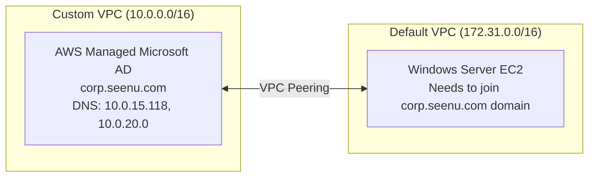

# 🛠 Cross-VPC AWS Active Directory Integration Lab

## **Overview**

This lab demonstrates how to connect a Windows EC2 instance in one VPC to an AWS Managed Microsoft AD in another VPC using **VPC Peering**, **Security Groups**, and **DNS configuration**.
Scenario mimics real-world multi-VPC enterprise setups.

---

## **Architecture**



---

## **Problem**

When trying to join the domain:

```
An Active Directory Domain Controller (AD DC) for the domain "corp.seenu.com" could not be contacted.
The operation returned because the timeout period expired. (0x000005B4 ERROR_TIMEOUT)
```

* DNS SRV record query for `_ldap._tcp.dc._msdcs.corp.seenu.com` timed out.
* Cause: **No network path or allowed ports between EC2 and AD DNS servers**.

---

## **Solution Steps**

### **1. VPC Peering**

* Create a VPC peering connection between:

  * **Requester**: Default VPC (172.31.0.0/16)
  * **Accepter**: Custom VPC (10.0.0.0/16)
* Update **route tables** in both VPCs:

  * Default VPC → Route to `10.0.0.0/16` via peering connection.
  * Custom VPC → Route to `172.31.0.0/16` via peering connection.

---

### **2. Security Group Rules**

#### On AD’s Security Group (ENIs for Directory Service):

Allow inbound from `172.31.0.0/16` for:

| Protocol | Port(s)     | Purpose                    |
| -------- | ----------- | -------------------------- |
| UDP/TCP  | 53          | DNS                        |
| UDP/TCP  | 88          | Kerberos Auth              |
| TCP      | 135         | RPC Endpoint Mapper        |
| UDP/TCP  | 389         | LDAP Directory Access      |
| TCP      | 445         | SMB / AD Replication       |
| UDP/TCP  | 464         | Kerberos Password Change   |
| TCP      | 3268-3269   | Global Catalog             |
| TCP      | 49152–65535 | RPC High Ports (Ephemeral) |

#### On EC2’s Security Group:

Allow inbound from `10.0.0.0/16` for the **same ports**. [repeat the same on ec2 SG as well]

---

### **3. DNS Configuration**

* In the **Windows EC2 network adapter settings**:

  * Set DNS servers to the AD DNS IPs:

    ```
    10.0.15.118
    10.0.20.0
    ```
  * Add DNS suffix: `corp.seenu.com`.

---

### **4. Domain Join**

* Run:

  ```
  sysdm.cpl → Change settings → Domain: corp.seenu.com
  ```
* Provide AD admin credentials.
* Reboot.

---

## **Key Lessons**

* **Ping is irrelevant** for AD join; Kerberos/LDAP ports are what matter.
* Without proper DNS resolution of SRV records, AD join will fail.
* VPC Peering **does not** auto-open ports; Security Groups must allow the traffic.
* Cross-VPC AD setup is common in enterprise AWS environments — this is **not just lab theory**.

---

## **Final Architecture**

```plaintext
Default VPC (172.31.0.0/16)
    ↔ VPC Peering ↔
Custom VPC (10.0.0.0/16)
[EC2: Windows]  ← TCP/UDP Ports →  [AWS Managed Microsoft AD]
```
---

## **Packet Flow: Cross-VPC AD Domain Join**

```plaintext
Step 1: EC2 → DNS Query
------------------------------------
EC2 (172.31.x.x) sends:
UDP/TCP 53 → AD DNS (10.0.15.118, 10.0.20.0)
Query: _ldap._tcp.dc._msdcs.corp.seenu.com
Purpose: Find available Domain Controllers.

Step 2: DNS Response
------------------------------------
AD DNS responds with:
SRV records → IP/hostname of DC
(e.g., ip-10-0-15-118.corp.seenu.com)

Step 3: Kerberos Authentication
------------------------------------
EC2 → DC:
UDP/TCP 88 (Kerberos) → Request ticket for domain join.

Step 4: LDAP Directory Lookup
------------------------------------
EC2 → DC:
TCP/UDP 389 → Fetch domain/OU info, validate user credentials.

Step 5: RPC & SMB Setup
------------------------------------
EC2 → DC:
TCP 135 (RPC Endpoint Mapper)
TCP 445 (SMB) → Create machine account in AD.

Step 6: Kerberos Password Set
------------------------------------
EC2 → DC:
TCP/UDP 464 → Set password for machine account.

Step 7: Global Catalog Access
------------------------------------
EC2 → DC:
TCP 3268–3269 → Query forest-wide info.

Step 8: RPC Ephemeral Ports
------------------------------------
EC2 ↔ DC:
TCP 49152–65535 → AD replication, group policy, trust setup.

Result:
------------------------------------
✅ EC2 reboots.
✅ Can log in with DOMAIN\username.
```

---

## **ASCII Network View**

```plaintext
  [Windows EC2] (172.31.5.10)  -- UDP/TCP 53,88,135,389,445,464,3268-3269,49152-65535 -->
        |  (VPC Peering)  |
  [AWS Managed AD] (10.0.15.118, 10.0.20.0)
```

---


## **Verification Checklist**

* [x] VPC Peering active + routes configured.
* [x] SG inbound rules for all required AD ports in both directions.
* [x] EC2 uses AD DNS IPs.
* [x] Successfully joined `corp.seenu.com` domain.
* [x] Logged in with AD user account.

---


